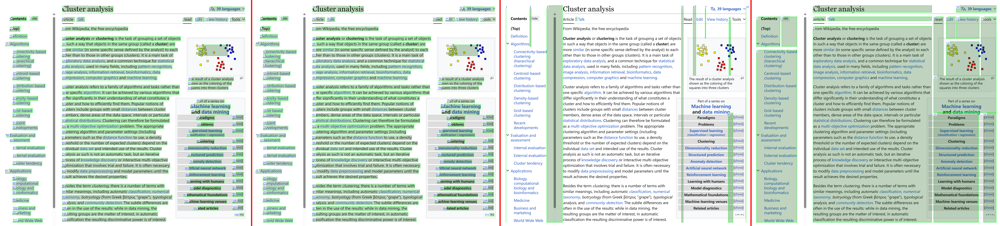

# GapTree_Sort 间隙·树·排序法

由 hiroi-sora 个人开发的，基于文本位置的版面分析/文本排序算法。适用于将OCR得到的文本块，按人类阅读顺序进行排序。特别针对多栏布局的报刊型排版。可能也适用于PDF解析等依赖版面分析的领域。

未来，它将嵌入到 [Umi-OCR](https://github.com/hiroi-sora/Umi-OCR) 中，为文档识别等功能提供后处理支持。

演示效果：请查看下方大图。图中从左到右有四个部分：
1. 原始OCR结果，存在一些错误排序，特别是无法区分不同列。
2. 经过本算法，大部分文本块得以正确排序。
3. 算法找出的竖切线（间隙）。
4. 算法找出的区块，顺序为布局树的前序遍历。



## 背景 - 文本块顺序

“文本块”指的是包含空间坐标的一行文本的信息。如：
```
{
    "bbox": (x0, y0, x1, y1), # 左上角、右下角坐标
    "text": "这是一行文本",
}
```

通过OCR（光学字符识别）可以从图片中识别出大量文本块。但是OCR原始输出的文本块列表，往往只是按简单的规则进行排序（如从上到下、从左到右）。如果图片中存在多列文本，则在OCR结果中，不同列的块会交叉混杂在一起，与人类阅读顺序不符。

PDF解析也有类似的问题。PDF是固定布局，所有元素（如图片、表格、文本块）的位置被嵌入到文档中。同一段落之内，不同的行往往被分为不同的文本块。这使得难以编辑或提取完整的文本流，或者提取的文本块存在顺序错乱的情况。

因此，我们需要一种**版面分析**手段，将离散的文本块重新组织回 行、列、小节 的版面结构。或者至少按正确的顺序串联起文本块，将其恢复为连续的文本流。

## 背景 - 版面分析

版面分析是指对文档页面中的内容进行结构化分析的过程，其目的是识别和分类页面上的不同区域，如标题、列、行、图像、表格等。通过版面分析，我们能得到文本块之间的关联，从而进行排序或排版重建。

目前已有的版面分析技术，主要分为 **图像分析** 和 **位置分析** 。

### 图像分析

先对文档的图片进行版面分析，将原始图片拆分为 `[标题, 正文, 表格]` 不同区块，再对每个区块进行提取文字。

可能包括使用边缘检测、纹理分析、连通区域分析、颜色分析等方法来区分文本和非文本元素，以及进一步识别出标题、段落、图表、图片等不同类型的内容区块。

现有基于图像的版面分析库，往往结合了深度学习，如 [PP-Structure](https://github.com/PaddlePaddle/PaddleOCR/tree/release/2.7/ppstructure) 。

优点：

- 经过充分训练的模型库，可以很好的**理解**图片中各个区块的逻辑关系，准确度高。
- 可以获取不同区块的类型（标题、正文、表格）。

缺点：

- 训练成本高：需要大量标注样本。
- 使用成本高：神经网络推理的性能开销较高，模型库、推理库占用空间大。
- 输入必须为图片。如果手上没有文档图片，只有文本块，则无法使用该方案。

### 位置分析

先通过OCR或PDF，得到一组文本块。再根据文本块的包围盒位置信息，分析出布局或顺序。

一些PDF解析库，涉及了基于元素位置的规则匹配算法。如 [pdf2docx](https://github.com/ArtifexSoftware/pdf2docx) 。

优点：

- 使用成本低：开销远比图像处理要小。
- 兼容性强：可以用在不同的任务流程中，比如不同的OCR组件、PDF提取等。

缺点：

- 如果没有额外信息，难以从位置中推断区块类型。
- 程序难以理解各个区块的逻辑关系，准确度低，或者容易出现误划分的情况。

## GapTree_Sort 间隙·树·排序法

这是一种对**文本块位置**进行规则匹配的版面分析算法。

简而言之：它根据每一整行中的文本块**间隙**，提取页面中所有的**竖切线**，将页面切割为不同的**列**，将列组织为**布局树**。最后，前序遍历布局树，即可得到符合人类阅读习惯的**文本块排序**。

优点：

- 支持 任意列数。
- 支持 列宽不一致。
- 支持 跨列区块。（如横跨左右两列的标题行）
- 参数极少，仅需提供文本块位置即可，无需额外的信息。
- 没有超参数（需要人工设定的阈值等），可自适应不同的情况。
- 对于列数较少的常见布局，假设文本块数为n，时间复杂度接近 O(nlogn) 。
- 鲁棒性强，即使因为噪声（OCR误划分）导致部分区块的排序错误，也能保证大部分文本块（如同一段落内）的排序是正确的。
- 实验代码`gap_tree.py`中，仅使用了Python标准库。

限制：

- 目前仅适用于横排方向，即从上到下、从左到右的阅读顺序。不过我觉得，对所有块的坐标进行旋转预处理（如旋转-90°），可以在不改变算法的基础上实现对竖排方向的处理，待未来验证。
- 无法判断区块的类型，所有元素均视为正文。
- 有很高的几率误划分区块（将同一表格、段落的文本，划分为不同区块）。但算法考虑到了即使在误划分的情况下，排序依然是正确的。
- 对于非标准排版（尤其是交错列，上下方的列不对齐），区块之间排序错误的几率高。

### 测试代码

git clone 本仓库。

`test.py` 为测试入口，其中的 `test_image` 为测试图片路径。本仓库提供了一些测试样例（包括原图片和OCR结果json），可以直接使用。如果你想用自己的样例，需要导入 [RapidOCR-json](https://github.com/hiroi-sora/RapidOCR-json) ，或者用其它方式获取文本块。

`gap_tree.py` 为算法文件。

`visualize.py` 为结果可视化工具，需要`Pillow`库。

### 算法说明

我用一个易懂的案例来介绍本算法。实际的算法流程中，可能与下方步骤略有不同。实际可能将多个步骤压缩为一个以提高性能。

假设对一个带标题栏的双列布局图片进行OCR，拿到了原始结果：

```
               ① 设计模式在团队中的作用                |
                                                     |
       ② 从设计模式和面向     ③ 计，可以避免你的团队    |
   ④ 对象原则的视角讨论设     ⑤ 很快陷入实现的细节。    |
```

显然，文本块 ①~⑤ 只是按从左到右从上到下排序，不符合双栏布局。

##### 第1步：划分行

将文本块按从上到下的顺序进行排序。

然后从上到下遍历所有文本块，划分出不同行。划分依据可以是 两个文本块的水平投影有重叠。

如下，划分出三行。【-->】

```
① ---------------> 设计模式在团队中的作用             |
                                                    |
② -------> 从设计模式和面向 ---> 计，可以避免你的团队  |
③ ---> 对象原则的视角讨论设 ---> 很快陷入实现的细节。  | 
```

##### 第2步：求间隙

对于每一行，视为一个一维数轴，文本块是其中的线段。

求该行的“间隙”，即没有被线段覆盖到的地方。【==】

```
================设计模式在团队中的作用===============|
                                                   |
========从设计模式和面向=====计，可以避免你的团队=====|
====对象原则的视角讨论设======很快陷入实现的细节。====|
```

##### 第3步：求竖切线

对当前在考虑的每一个间隙，检查与下一行的间隙的线段交集。

如果下一行的间隙与当前间隙不完全一致，那么要更新当前间隙，包括缩短、分裂、结束 等。例如：

```
当前间隙：|      ============         ====  |
下行间隙：|    =====     =========          |
更新后：  |      ===     ====               |
说明：        ↑缩短   ↑分裂    ↑缩短    ↑结束
```

记录经过每一行更新的间隙，我们可以得到“竖切线”。一条竖切线由多个连续行的、同一位置的间隙所组成，能“切分”不同列。【##】

```
####            设计模式在团队中的作用           ##|
####                                           ##|
####    从设计模式和面向#####计，可以避免你的团队 ##|
####对象原则的视角讨论设##### 很快陷入实现的细节。##|
```

##### 第4步：求区块

根据所有竖切线，我们再次遍历每一行，将文本块划分到不同区块中。

每个区块可包含多个行的文本块。划分完成后，对每个区块内的文本块，从上到下进行排序。

如下，划分出 A B C 三个区块

```
#### AAAAAAAAAAAAAAAAAAAAAAAAAAAAAAAAAAAAAAAAA ##|
#### AAAAAAAAAAAAAAAAAAAAAAAAAAAAAAAAAAAAAAAAA ##|
#### BBBBBBBBBBBBBBBB ##### CCCCCCCCCCCCCCCCCC ##|
#### BBBBBBBBBBBBBBBB ##### CCCCCCCCCCCCCCCCCC ##|
```

##### 第5步：生成布局树

将每个区块，作为树的一个节点。我们有了很多个节点，下面将这些节点连接成树。

遍历每个节点A，找父节点F，规则为：

1. A 的右边界，必须包含在 F 的左右边界之内。
2. A 顶部，低于 F 的底部。
3. F 与 A 的垂直距离（行数）最近。
4. 可能有多个F满足3的条件（底部在同一行），取最右的一个F作为父节点。
5. 如果没有节点满足上述，则 A 的父节点为根。

例如：

```
#### AAAAAAAAAAAAAAA【父：根】AAAAAAAAAAAAAAAAA ##|
#### AAAAAAAAAAAAAAAAAAAAAAAAAAAAAAAAAAAAAAAAA ##|
#### BBBB【父：A】BBBB ##### CCCCC【父：A】CCCC ##|
#### BBBBBBBBBBBBBBBB ##### CCCCCCCCCCCCCCCCCC ##|
```

##### 第6步：前序遍历布局树

对于上述样例的树，前序遍历得到的节点序列为： `L = [A, B, C]`

##### 第7步：整理文本块排序

遍历节点序列L，对每个序列，从上到下输出文本块，顺序为：

```
               ① 设计模式在团队中的作用                |
                                                     |
       ② 从设计模式和面向     ④ 计，可以避免你的团队    |
   ③ 对象原则的视角讨论设     ⑤ 很快陷入实现的细节。    |
```

显然，排序后的文本块 ①~⑤ 符合双栏布局的阅读顺序。

对于多栏布局或更复杂的非固定列布局，本算法也有较好的效果。